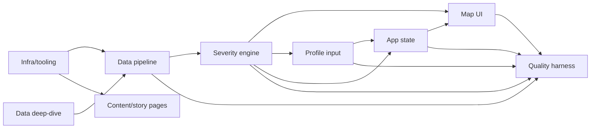

# Horizontal Plan — Allergy Locator: Interactive Map MVP (v1)

Maps every architectural layer this epic touches and the cross-layer dependencies between
them. Scope is v1 only per `design-discussion.md` §1b — v2 (agentic ingestion) and v3
(multi-profile/family) are referenced for continuity but not built here.

## Layers

### L1 — Infra/tooling
Next.js (App Router, TypeScript) scaffold, pnpm, Tailwind CSS config, Vercel project
wiring (hobby plan, auto-deploy on push to `main`), `.env.example` (documents the
optional `GOOGLE_POLLEN_API_KEY` var name with no value). Foundation every other layer
sits on. No cross-layer dependency — this ships first.

### L2 — Data pipeline (build-time)
`scripts/build-data.ts`: normalizes `data/species-ranges.json` + season/climate inputs
from `data/allergen-map-data.md`, plus any newly-sourced open datasets from the L2b
deep-dive, into one baked `data/severity-model.json`. Zero runtime fetch for the core.
Depends on: L1 (build tooling exists). Feeds: L3 (severity engine consumes the baked
JSON).

**L2b — Data deep-dive (research sub-layer).** Survey open, freely-embeddable US
datasets for the turf/irrigation and arid-weed severity sub-layers (candidates: USDA
Cropland Data Layer, NOAA climate normals, EPA AirNow — validate licensing before
committing to any). Output feeds L2's normalization script. AAAAI/NAB stay reference-
only, never embedded, per `REQUIREMENTS.md`.

### L3 — Severity scoring engine (domain logic)
Pure functions: presence gate (per allergen, per state) + severity score (season length ×
intensity × climate + turf weighting + arid-weed/dust layer), computed **per allergen**
so toggle views work, plus a **timeframe parameter** (month/date) that re-scores against
the seasonal-outlook data rather than a single static score. No UI, no I/O — testable in
total isolation against the `docs/E2E-TESTING.md` oracle table. Depends on: L2 (baked
data). Feeds: L4 (map UI), L6 (state/API layer reads engine outputs to validate imported
panels).

### L4 — Map rendering + interaction UI
Inlined SVG map (`data/us_states.svg` / `us_state_paths.json`), color scale bound to L3's
output for the active panel + active toggle/timeframe selection. Per-allergen toggle
controls, date/timeframe control, click-through detail panel (allergens present + season
window + plain-English why). Depends on: L3 (scores to render), L5 (active panel/state
to render for), L6 (reads/writes UI state). Feeds: nothing (leaf/presentation layer).

### L5 — Profile/panel input
Manual allergen picker, load-the-author-preset shortcut, JSON/CSV panel import +
validation (reject malformed/incomplete panels with a clear error, never silently guess).
Produces one canonical panel object. Depends on: L3 (needs the known-allergen list/schema
the engine expects). Feeds: L6 (the active panel is part of app state), L4 (UI reads the
active panel to know what's selected).

### L6 — App state + agent-controllable surface
Single source of truth for: active panel, active allergen toggles, active timeframe.
Serializes cleanly to URL query params (v1's only "agentic" deliverable — see
design-discussion §2 item 7). No chat agent, no LLM call, no MCP server in v1 — this
layer's job is only to keep state clean enough that v2 can add those without a rewrite.
Depends on: L5 (panel shape), L3 (toggle/timeframe vocabulary). Feeds: L4 (UI renders from
this state), URL bar (shareable links).

### L7 — Content/story pages
`/about` route, tabbed ("My Story" / "The Project"), sourced from `docs/story/*.md`
content, plus the "not medical advice" / "no place cures you" disclaimer rendered
consistently across map, click-through, and about pages. Two design variants produced via
`/design` delegation (user picks or both ship). Depends on: L1 only (Tailwind/Next.js
routing) — **no dependency on L2-L6**, so this layer's stories can run in parallel with
the severity-engine/map-UI work rather than waiting on it.

### L8 — Quality/test harness
Unit tests (severity engine, table-driven from the E2E oracle, including per-allergen and
per-timeframe assertions), data-integrity tests (schema/gate checks on `data/*.json`),
Playwright E2E (author-preset ground-truth assertions + the zero-external-calls and
no-secrets-in-bundle guardrails), GitHub Actions CI wiring. Depends on: L2-L6 existing
enough to have something to test against — but the harness's *scaffolding* (test runner
config, CI skeleton) should land early (see vertical plan Slice 0/1) so later slices are
protected by it rather than bolted on at the end.

## Cross-layer dependency graph

## Note (round 2)
Vertical slicing adds a **Slice 0 — tooling & skill readiness** ahead of L1 scaffold work:
confirming the right Claude Code skills/plugins (frontend design, webapp testing, dataviz
palette work; `mcp-builder` reserved for v2) are enabled before any of the layers below
are built. See `vertical-plan.md` Slice 0. This isn't a horizontal *application* layer —
it's environment setup — so it isn't numbered L0 here, but it gates everything below.

## Notes for vertical slicing
- L7 (content/story pages) has no real dependency on the severity engine or map — it can
  be pulled forward or run in parallel without blocking the riskier data/logic work.
- L3 (severity engine) is the highest-risk, highest-value layer and should be built and
  proven against the E2E oracle **before** the UI layers that consume it, so mistakes are
  caught in fast unit tests, not slow end-to-end debugging.
- L2b (data deep-dive) is a research task that can start immediately and in parallel with
  L1 scaffold work — it doesn't block infra, only blocks the *complete* L2 pipeline
  (turf/arid-weed sub-layers specifically; the presence/season/climate portion of L2 has
  no such dependency and can proceed immediately on already-committed data).
- L6 (app state / agent-controllable surface) is deliberately thin in v1 — it exists so v2
  isn't a rewrite, not because v1 needs URL-state for its own sake. Don't over-build it.
