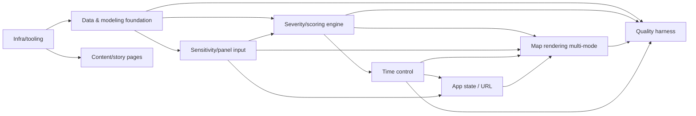

# Horizontal Plan v2 — Allergy Locator (re-plan, round 3 scope)

Supersedes the v1 horizontal plan. Reflects the general all-allergen, two-mode,
time-dimensioned scope locked in `design-discussion.md` v3.

## Layers

### L1 — Infra/tooling
Unchanged from v1: Next.js (App Router, TS) + Tailwind + pnpm + Vercel + CI/test
skeleton + tooling-skill readiness (Slice 0, still incomplete from the prior attempt).

### L2 — Data & modeling foundation
`data/species-ranges.json` (15 species, the author's curated reactive subset — already
exists), `data/cities.json` + `data/allergy-scores.json` + `data/allergy-scoring.md`
(168-city spine + validated grass formula — already exists, do not rebuild). **New in
this round (comprehensive-scope correction):** a data-sourcing task to pull every
allergen there's open data for — expanded grass/weed/tree species beyond the current
15, plus **mold** as its own category (spore-based, humidity/moisture-driven, not
bloom-season; the standard NAB source is reuse-restricted per `REQUIREMENTS.md`, so
this needs an open alternative or an honestly-labeled modeled proxy). A generalized
per-allergen severity model extends the grass methodology to every sourced allergen
(modeled, not ground-truth-validated — confidence labeled honestly per design-
discussion §2 item 1), plus a season-position model (month/date-indexed severity curve
per allergen category, per design-discussion §2 item 2 — genuinely new modeling work).
**Architecture constraint binding on this layer and everything downstream:** the
allergen list is data-driven — L2's output is consumed as a loopable data structure,
never a hardcoded enum/list in L3/L4/L6 code. Feeds: L3.

### L3 — Severity/scoring engine
Pure functions: `severityFor(allergen, city, timeframe) -> {value, confidence}`
(per-allergen, per-city, per-timeframe) and `compositeFor(sensitivities, city,
timeframe) -> value` (Mode 2's weighted aggregation across all toggled/weighted
allergens). No UI, no I/O. Depends on: L2. Feeds: L4 (rendering), L5 (time control
reads/writes the timeframe parameter this layer consumes), L9 (test target).

### L4 — Map rendering (multi-mode)
Mode 1: N toggleable per-allergen gradient overlays on the 168-city point map. Mode 2:
one composite green→red overlay driven by sensitivity sliders. Click-through detail
panel (per-allergen or composite breakdown + plain-English why, timeframe-aware).
Depends on: L3 (values to render), L6 (active sliders/toggles), L5 (active timeframe).
Feeds: nothing (leaf/presentation layer).

### L5 — Time control
Month/date selector (feeds L3's timeframe parameter) + year-playback animation (steps
through L3's outputs across months) + report generation (best time+place summary,
worst-avoid list, depends on L3 + L6's active sensitivity state). Depends on: L3.
Feeds: L4 (UI controls), L7 (timeframe is part of serialized state).

### L6 — Sensitivity/panel input
Per-allergen sensitivity sliders (Mode 2), allergen toggle set (Mode 1), author's-
example loader (flagship preset), JSON/CSV import for a full slider-set. Depends on:
L2 (needs the known-allergen list). Feeds: L3 (composite input), L4, L7.

### L7 — App state + agent-controllable URL state
Single source of truth: active mode, per-allergen toggles/sliders, active timeframe.
Serializes to URL query params. Depends on: L5, L6. Feeds: L4, shareable links. Kept
thin — no chat/LLM in this epic (see `.pHive/planning/roadmap.md` for v2's agentic
plan, unchanged).

### L8 — Content/story pages
`/about` route, tabbed ("My Story" / "The Project"), **both** `ABOUT.md` and
`ABOUT-v2.md` content behind an in-page toggle (user's explicit round-3 ask — ship both,
not a `/design`-resolved single choice). Depends on: L1 only — **no dependency on
L2-L7**, same as v1/v2's about-page independence.

### L9 — Quality/test harness
Unit tests for L3 (grass validated against `MY-ANSWER.md`'s ground-truth table across
multiple timeframe positions; weed/tree tested for plausibility/presence only, not
ground truth — honestly scoped per design-discussion §2 item 1). Data-integrity checks.
Playwright E2E (both modes, playback, reports, guardrails: zero external calls,
`secret_scan`). CI wiring. Depends on: L2-L7 existing enough to test; scaffolding should
land early (Slice 1) so later slices are protected, per the v1 plan's same reasoning.

## Cross-layer dependency graph

## Notes for vertical slicing
- L3 (severity engine) is still the highest-risk layer, but now has two distinct
  sub-risks: generalizing beyond grass (modeling risk, not data-sourcing risk — the
  data needed already exists) and adding the timeframe dimension (genuinely new
  modeling work per design-discussion Risk #2). Sequence grass-only-and-current-only
  first to prove the pipeline before compounding both risks at once.
- L8 (content/story pages) remains fully independent of L2-L7, same as prior rounds —
  parallel-eligible.
- L5's three pieces (season-position scoring, playback, reports) have a natural internal
  order: scoring must exist before playback can animate through it, and reports need
  both scoring and the composite (L3 Mode 2) to summarize. Don't build playback or
  reports before season-position scoring is real.
