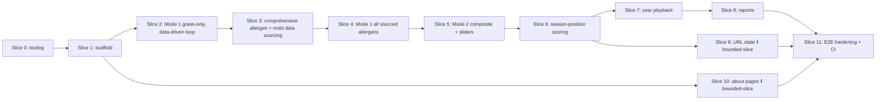

# Vertical Plan v3 — Allergy Locator (re-plan, round 3 scope, comprehensive allergens)

Supersedes the v1/v2 vertical plans. 12 slices (0-11). Inserts a dedicated
comprehensive-allergen-data-sourcing slice per the user's explicit correction: pull
**all** allergy data there's source for (not a curated 15-species list), including
mold, with the allergen list always **data-driven** in the UI/engine (never hardcoded).

## Slice 0 — Tooling & skill readiness
Unchanged. Still incomplete (prior background teammate failed before the session
restart). First slice, no dependency.

## Slice 1 — Scaffold + deploy skeleton
Unchanged: Next.js + Tailwind + Vercel + disclaimer footer + CI/test skeleton.
Depends on: Slice 0.

## Slice 2 — Mode 1, grass only, current timeframe only (thinnest possible real proof)
**Delivers:** the single already-validated allergen (grass) rendered as one toggleable
gradient overlay across the 168-city spine, using `allergy-scores.json` as-is. Click a
city → grass severity + why. **Critically, build the allergen-toggle UI as a loop over
a data structure from day one** (even with one entry) — this proves the "data-driven,
never hardcoded" architecture (§7 non-negotiable) at the smallest possible scale, so
Slice 4 (all sourced allergens) is additive data, not a UI rewrite.
**Working state:** a real, correct Mode-1 map for one allergen, built the
data-driven-loop way from the start.
**Depends on:** Slice 1.

## Slice 3 — Comprehensive allergen + mold data sourcing (new, round 3)
**Delivers:** a research story that sources open data for every allergen there's data
for — expanded grass/weed/tree species beyond the current 15, **and mold** as its own
category. Mold is spore-based (humidity/moisture-driven, not bloom-season) and needs
its own data source and model; the standard source (NAB) is already documented in
`REQUIREMENTS.md` as reference/QA-only, not embeddable, so this story must find an
open, embeddable alternative or build an honestly-labeled modeled proxy from humidity/
climate data. Produces a data file (or extension of `species-ranges.json`) covering the
full sourced list, each entry flagged `confidence: validated | modeled`.
**Working state:** a comprehensive, documented allergen dataset exists on disk, ready
for the engine to consume — nothing UI-facing changes yet.
**Depends on:** Slice 2 (data-driven UI pattern proven first, so this slice's output
just slots in).

## Slice 4 — Mode 1, all sourced allergens
**Delivers:** the Slice-2 data-driven toggle UI now iterates over Slice 3's full
allergen dataset — every sourced allergen (trees, grasses, weeds, mold) gets its own
toggle + distinct gradient color (palette work via `dataviz` skill), with zero
hardcoded per-allergen UI code. Confidence labeled `validated` (grass) vs. `modeled`
(everything else) per data-discussion §2 item 1.
**Working state:** every allergen the data-sourcing step found can be toggled on/off
with a real, honestly-labeled overlay — adding a new allergen to the data file requires
no code change.
**Depends on:** Slice 3.

## Slice 5 — Mode 2: personalized composite via sensitivity sliders
**Delivers:** a sensitivity slider per allergen (looped from the same data-driven
source as Slice 4's toggles); the composite green→red score weights and sums the
active allergens' Slice-4 values. The author's real panel loads as the flagship "load
example" default.
**Working state:** any user can set sensitivities across the full allergen list and see
a personalized map — the actual reverse-lookup the whole product exists for.
**Depends on:** Slice 4.

## Slice 6 — Season-position scoring
**Delivers:** a month/date parameter threaded into the severity engine, backed by a
research step operationalizing the season-length literature already cited in
`MODEL-NOTES.md` (plus, for mold, humidity/moisture seasonality) into a real curve per
category. Both modes re-score when the month changes.
**Working state:** pick a month, watch both modes re-score accordingly, across every
allergen category (pollen AND mold).
**Depends on:** Slice 5 (needs the full engine, both modes, before adding a new
parameter to it).

## Slice 7 — Year playback
**Delivers:** a "play the year" control that animates through Slice 6's month
positions, showing highs/lows over a year for the active mode/profile.
**Working state:** press play, watch a city's (or your composite's) severity rise and
fall through the year — surfaces "mid-summer Florida vs. winter Alaska for YOU."
**Depends on:** Slice 6.

## Slice 8 — Reports
**Delivers:** a generated summary for the active sensitivity profile — best time +
place, a worst-avoid list, notable seasonal windows. The concrete "by the END of this"
deliverable.
**Working state:** generate a real report from your current slider configuration.
**Depends on:** Slice 7.

## Slice 9 — Agent-controllable URL state
**Delivers:** serialize the full state (mode, all allergen sliders/toggles, active
timeframe) to URL query params — schema sized to however many allergens Slice 3
produced, likely a compressed/encoded param rather than one per allergen.
**Working state:** a URL fully reproduces a given configured view, including timeframe.
**Depends on:** Slice 6 (needs the full state shape to exist first). **Parallel-
eligible** against Slices 7-8 (touches only `lib/url-state.ts` + control-wiring,
disjoint from playback/report work).

## Slice 10 — Story/about pages
**Delivers:** tabbed `/about` ("My Story" vs. "The Project"), with **both** `ABOUT.md`
and `ABOUT-v2.md` shipped behind an in-page toggle. Two-variant `/design` delegation
still produces the layout pass.
**Working state:** `/about` live with both narrative and project-explanation content,
user flips between the two "Project" copy variants live.
**Depends on:** Slice 1 only — **no dependency on Slices 2-9**. Parallel-eligible
across the whole build.

## Slice 11 — Full E2E hardening + CI
**Delivers:** full Playwright suite — grass validated against `MY-ANSWER.md`'s ground-
truth table across multiple timeframe positions; every other allergen (including mold)
tested for plausibility/presence only (honestly scoped, no ground-truth table exists
for those); playback and report generation covered; guardrails (zero external calls,
`secret_scan`); CI wired on every push.
**Working state:** every future push is verified against the full answer key (where one
exists) and the open-source non-negotiables.
**Depends on:** Slice 8, Slice 9, Slice 10 (last slice — needs everything else built).

## Sequencing summary

## Explicitly out of scope for this epic (unchanged — see `.pHive/planning/roadmap.md` + `docs/ROADMAP.md`)
- Agentic panel ingestion (LLM parse + verify), in-app chat agent, published MCP/tool-
  spec wrapper beyond Slice 9's URL state — v2.
- Saved/named multiple profiles, multi-profile overlay (family use case) — v3.
- True live meteorological forecasting (this epic's time dimension is a modeled
  seasonal curve, not a weather feed).
- County/raster continuous heatmap rendering, multi-dimension overlays beyond allergy
  (care access, cost, etc.) — `docs/ROADMAP.md` Phase 2+.
- Ground-truth validation for non-grass allergens (modeled only in this epic — a future
  validation pass if/when ground-truth data exists for those categories).
