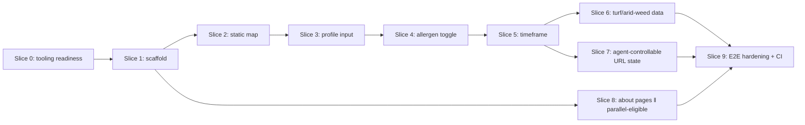

# Vertical Plan — Allergy Locator: Interactive Map MVP (v1)

Cuts the horizontal layers (`horizontal-plan.md`) into sequential, cross-stack slices.
Every slice leaves the product in a genuinely working, deployed state — this is the
vertical-planning invariant. Story decomposition (Phase C) maps 1:1 or 1:N onto these
slices.

**Revision note (round 2):** added Slice 0 (tooling/skill readiness) per user request —
"ensure this Claude is setup correctly... HAVE THE TOOLS NECESSARY" before any app code
is written. All prior slices renumbered +1 (old Slice 0 → Slice 1, etc.). v2/v3 roadmap
content moved out to the persistent `.pHive/planning/roadmap.md` (project-level, survives
this epic).

## Slice 0 — Tooling & skill readiness (new, round 2)
**Layers touched:** none of the app layers — this slice configures the Claude Code
environment itself, not the repo's runtime code.
**Delivers:** the Claude Code skills/plugins this build actually needs are identified,
installed/enabled, and smoke-tested, so later slices don't stall rediscovering
capability gaps mid-build. Concretely, evaluate and enable:
- **From the official `anthropics/skills` marketplace** (not yet installed in this
  project as of this plan — verify at execution time):
  - `frontend-design` — polished, accessible UI construction; directly used by every UI
    slice from Slice 2 onward.
  - `webapp-testing` — Playwright-based web app testing; aligns with `docs/E2E-TESTING.md`'s
    already-specified Playwright plan (Slice 9).
  - `skill-creator` (optional) — for authoring/evaluating any custom project skill this
    repo ends up wanting (e.g., a `/run` launch recipe for the Next.js dev server).
  - `mcp-builder` — not needed in v1; confirm it's available for when v2 (agentic
    ingestion + agent API, see `.pHive/planning/roadmap.md`) starts, so it isn't a
    fresh discovery then.
- **From the community ecosystem (skills.sh)** — candidates to evaluate, not
  pre-committed (verify current install mechanism and maintenance status live rather
  than assuming from a point-in-time summary):
  - `vercel-react-best-practices` — Next.js/Vercel-specific patterns.
  - `shadcn` — accessible component primitives that pair with Tailwind (§ styling
    decision, already confirmed Tailwind).
- **Already available in this session, confirm still enabled going into Slice 1+:**
  `dataviz` (colorblind-safe, multi-series palette — feeds Risk #5 directly), `run`
  (launch/verify the dev app once scaffolded), `review` / `security-review` (the
  `secret_scan` and zero-external-calls guardrails), the already-connected Playwright
  MCP tools (may make a separate `webapp-testing` skill redundant — decide one path,
  don't run both).
**Working state:** a documented, current list of enabled skills/plugins for this repo
(e.g. recorded in `.pHive/CONTEXT.md` or a short `TOOLING.md`), with one trivial
smoke-test per newly-enabled skill (e.g., ask `frontend-design` to review a throwaway
component) proving it actually loads and responds — not just "installed," but "verified
working" per this project's own developer-notes convention ("render it or it doesn't
exist").
**Depends on:** nothing — true first slice, before any app code.

## Slice 1 — Scaffold + deploy skeleton
**Layers touched:** L1, L8 (scaffolding only).
**Delivers:** a live Vercel URL running a minimal Next.js + Tailwind app (placeholder
home page, disclaimer footer already wired since it's needed everywhere from here on),
test runner + CI skeleton in place (empty suites are fine — the *pipes* exist).
**Working state:** a real, deployed, empty app at a public URL, auto-deploying on push.
**Depends on:** Slice 0.

## Slice 2 — Static severity map for one hardcoded profile (the riskiest logic, first)
*("Static" = baked build-time data + inlined-SVG rendering, per `design-discussion.md`
§1a's round-3 clarification — the map itself is still a dynamic, interactive heatmap;
only the active *profile* is hardcoded in this slice, not yet the coloring behavior.)*
**Layers touched:** L2 (presence + season/climate portion only — turf/arid-weed deferred
to Slice 6), L3 (blended score only, no per-allergen toggle yet, no timeframe yet), L4
(basic map render + click-through, no toggle/date controls yet).
**Delivers:** the author's preset panel is hardcoded; the map renders real severity
coloring for it; clicking a state shows allergens + season + why. This is the thinnest
possible slice that proves the core, highest-risk logic (severity ≠ presence) actually
works, and it's checkable against the E2E oracle table's core assertions (Coconino green,
Carlsbad not-green, Mesa elevated, red-belt South) immediately.
**Working state:** a live map that correctly colors the US for one real, verifiable
profile.
**Depends on:** Slice 1.

## Slice 3 — Profile input: manual picker + JSON/CSV import
**Layers touched:** L5 (picker UI + import + validation), L6 (single active-panel state,
replacing the Slice-2 hardcode), L4 (UI reads the active panel instead of a constant).
**Delivers:** any user — not just the author — can select their own allergens or import a
JSON/CSV panel and see their own personalized map. The author preset becomes a "load
example" shortcut rather than the only path.
**Working state:** the tool works for an arbitrary user's panel, not just the demo one.
**Depends on:** Slice 2.

## Slice 4 — Per-allergen toggle layer
**Layers touched:** L3 (extend scoring to per-allergen output), L4 (toggle controls +
single-allergen isolated coloring view), L8 (per-allergen unit assertions).
**Delivers:** users can turn individual allergens on/off and see which one is actually
driving a state's color — not just a combined score.
**Working state:** map supports both "my whole panel" and "just this one allergen" views.
**Depends on:** Slice 3.

## Slice 5 — Date/timeframe control (climatological outlook)
**Layers touched:** L3 (timeframe-aware scoring using seasonal data), L4 (date/month
selector control), L8 (per-timeframe assertions).
**Delivers:** users can move a date/timeframe control and see the map re-score for that
point in the year — trip/move planning across seasons, not just "right now." Ships as the
climatological-outlook interpretation locked in `design-discussion.md` §4 Risk #7 (not
live meteorological forecasting).
**Working state:** map is time-aware; combined with Slice 4, users can ask "which
allergen, and when."
**Depends on:** Slice 4.

## Slice 6 — Turf/irrigation + arid-weed data integration
**Layers touched:** L2b (deep-dive research — can start as early as Slice 0/1 in
parallel, but its *integration* lands here), L2 (extend the baked model with the new
sub-layers), L3 (incorporate turf/arid-weed weighting into scoring), L8 (the remaining
E2E oracle assertions that specifically require this layer — Carlsbad's full severity,
Mesa's irrigated-turf bump).

**External input in flight (round 3):** a separate research pass is producing
`docs/TURF-DATA-SOURCES.md` (verified open sources + a recommended combine rule +
anything rejected as not-open) outside this `/plan` session, deliberately left
uncommitted so it doesn't collide with planning artifacts. It did not exist as of this
plan's writing. When this slice's `research` step runs (or sooner, if it lands before
then), read that file first — it may answer the sourcing half of this slice directly —
then commit it alongside this slice's own work rather than re-deriving the same survey.
**Delivers:** the full severity model per `docs/MODEL-NOTES.md`, not the Slice-2
approximation — this is what makes the map match 100% of the E2E oracle table instead of
just the assertions that don't require turf/arid-weed data.
**Working state:** map matches the complete, documented answer key.
**Depends on:** Slice 5 (sequenced last among the scoring slices since it's the slice most
likely to need new data-sourcing decisions — doesn't block earlier, simpler slices on an
open research question).

## Slice 7 — Agent-controllable URL state
**Layers touched:** L6 (serialize full state — panel, toggles, timeframe — to URL query
params).
**Delivers:** the whole map configuration round-trips through a shareable URL. This is
v1's only "agentic" deliverable (design-discussion §2 item 7) — no chat, no LLM, just a
clean serialization contract that v2 (`.pHive/planning/roadmap.md`) will target later.
**Working state:** a URL fully reproduces a given map view; useful to humans today
independent of any future agent use.
**Depends on:** Slice 5 (needs the full state shape — panel + toggles + timeframe — to
exist before it's worth serializing).

## Slice 8 — Story/about pages
**Layers touched:** L7 (tabbed `/about`, two design variants via `/design` delegation),
L1 (routing only).
**Delivers:** the origin story and project explanation live on the real site, not just in
repo markdown.
**Working state:** `/about` is live with both narrative and project-explanation content.
**Depends on:** Slice 1 only — **no dependency on Slices 2-7**. Sequenced here for
narrative flow, but flagged explicitly parallelizable: at execution time this can run
concurrently with Slices 2-7 (see `parallel_allowed` on its story in Phase C).

## Slice 9 — Full E2E hardening + CI
**Layers touched:** L8 completion — full Playwright suite against the complete oracle
table (all 8 places, all toggle/timeframe combinations that matter), the zero-external-
calls guardrail, the no-secrets-in-bundle guardrail (`secret_scan`), CI wired to run all
of it on every push.
**Delivers:** the guarantees the whole project rests on (correctness vs. the author's
panel, zero secrets, zero external calls) are enforced automatically, not just asserted
in docs.
**Working state:** every future push is verified against the full answer key and the
open-source non-negotiables before it can be trusted.
**Depends on:** Slice 8 (last slice — needs everything else built to have something
complete to harden).

## Sequencing summary

## Explicitly out of scope for this epic (v2/v3 — full detail in `.pHive/planning/roadmap.md`)
- Agentic panel ingestion (LLM parse + independent LLM verify pass) — v2.
- In-app chat agent and any published MCP/tool-spec wrapper beyond Slice 7's URL state —
  v2.
- Saved/named multiple profiles, save/share beyond a URL, multi-profile overlay (family
  use case) — v3.
- True live meteorological pollen forecasting (only the optional, already-existing
  Google-Pollen "current conditions" toggle and Slice 5's climatological outlook ship).
